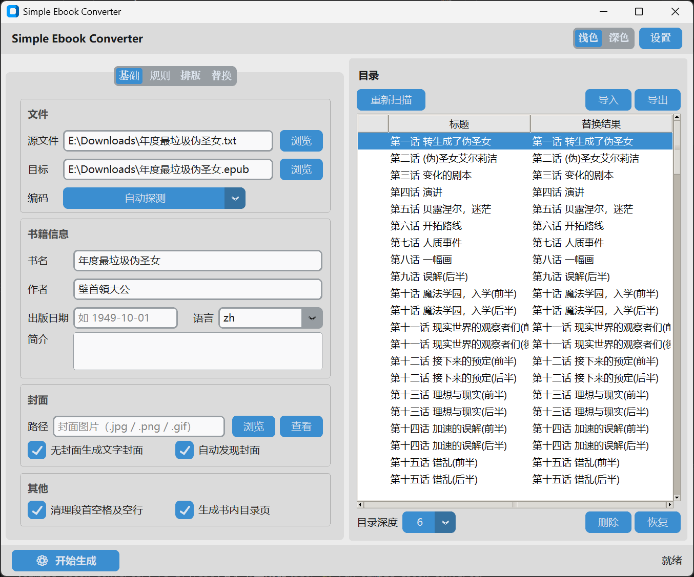

# simple-ebook-converter

TXT 转 EPUB3 工具。自动识别编码、按标题切分章节、生成目录与封面，输出标准 EPUB3。提供GUI和CLI两个入口。



## 安装

用 [uv](https://github.com/astral-sh/uv)（推荐）：

```bash
uv sync                 # 只装核心库与 CLI
uv sync --extra gui     # 额外装 GUI 依赖
```

或用 pip：

```bash
pip install -e .
pip install -e ".[gui]"   # 需要图形界面时
```

## 运行

### 图形界面（推荐）

```bash
uv run simple-ebook-converter
```

### 命令行

```bash
# 查看全部选项
uv run simple-ebook-converter-cli --help

# 最简：转换一本书
uv run simple-ebook-converter-cli 我的小说.txt
```

### 可执行文件（免安装）

从 [**Releases**](https://github.com/mosaic-roll/simple-ebook-converter/releases/latest) 下载 `simple-ebook-converter-windows.zip`，解压后运行：

```powershell
# 图形界面：双击 simple-ebook-converter.exe

# 命令行
.\simple-ebook-converter-cli.exe 我的小说.txt
```

选项与其他方式基本一致，上文的 `uv run simple-ebook-converter-cli` 换成 `.\simple-ebook-converter-cli.exe` 即可。

配置在 `config` 文件夹下。解压出的文件夹要整体保留，两个 exe 共用同级的 `_internal`。

## 简要说明

### 常用正则表达式

章节识别会匹配识别到的整行。

数字标题的章节误报严重，因此没有内置。

- 匹配： `1、章节`，包括全半角数字
  ```
  ^[0-9０-９]+、
  ```


- 匹配：`一、章节`
  ```
  ^[一二三四五六七八九十百千零〇両两兩萬万]+、
  ```

- 匹配： `第一章`
  ```
  ^第[一二三四五六七八九十百千零〇両两兩萬万]+章
  ```

### 删除错误匹配的标题

可以在图形界面的目录中删除错误匹配的章节标题。被删除的行将被当作正文处理。

文本开头，未匹配到任何标题，默认启用的「前言」标题无法删除，请知悉。

### 添加封面

封面图片格式推荐使用 png 和 jpg。

也可以用 gif、 webp、svg、avif。

但 webp、svg 在阅读器中兼容性较差，avif 在epub标准中仍处于草稿阶段。

### 更改配置文件夹位置

使用以下命令启动GUI程序。

`uv run simple-ebook-converter --config-dir DIRECTORY`

配置文件默认创建在程序启动目录下的`config`文件夹。

只有GUI界面拥有配置。

### 命令行

输入输出：

- 输入：直接作为位置参数（`我的小说.txt`），或用 `-i/--input` 指定。省略则报错。
- 输出：`-o/--out` 指定输出文件名（不含扩展名）。省略则取输入文件名，默认覆盖同名 `.epub`；用 `--no-overwrite` 禁止覆盖。

```bash
uv run simple-ebook-converter-cli -i 我的小说.txt -o 输出名
```

常用元数据：

```bash
uv run simple-ebook-converter-cli 我的小说.txt \
  --title "书名" --author "作者" --date 2024-05-13 \
  --language zh --cover cover.jpg
```

`--title` （书名）、`--author` （作者）， 不写则从文件名猜（格式：`《书名》作者：作者`）；`--date` 不写则省略；`--cover` 不写则自动发现同目录的 `cover.*`。

章节识别：

```bash
# 自定义卷 / 章标题正则
uv run simple-ebook-converter-cli 我的小说.txt \
  --volume  "自定义卷标题正则" \
  --chapter "自定义章标题正则"

# 无卷名小说：卷不作为标题
uv run simple-ebook-converter-cli 无卷小说.txt --no-volume
```

**标题正则匹配整行**：一条规则命中，代表整行被当作标题；未命中的行按正文处理。命中行若超过 `--max-title-len`（默认 35 字）也按正文处理。

对识别出来的标题不满意，可以用 `--replace-rules` 替换标题内容。规则写在 JSON 文件里：

```json
[
  { "pattern": "^第(.+)章\\s*", "replace": "第\\1章 " },
  { "pattern": "(第.{1,10}章)\\s*", "replace": "<span class=\"chapter-number\">\\1</span>", "stage": "html" }
]
```

规则分两个阶段，**针对原文的 `raw` 规则永远排在 `html` 规则之前**：

| `stage`       | 作用对象         | 用途                                       |
| ------------- | ---------------- | ------------------------------------------ |
| `raw`（默认） | 转义前的原始标题 | 改名、去前缀等纯文本处理                   |
| `html`        | 转义后的标题     | 注入 HTML 标签，配合 `--css-append` 上样式 |

`html` 阶段可用于自定义标题样式。比如把章节编号和标题内容**分行显示**：

正则：

```
(第.+章)\s*(.+)
```

替换：

```
<span class="chapter-number">\1</span><br /><span class="chapter-title">\2</span>
```

JSON（正则需要转义）

```json
[{ "pattern": "(第.+章)\\s*(.+)", "replace": "<span class=\"chapter-number\">\\1</span><br /><span class=\"chapter-title\">\\2</span>", "stage": "html" }]
```

```css
.chapter-number { display: block; font-size: 0.65em; }
.chapter-title { display:block; }
```

默认开启的选项及禁用方式：

| 默认行为                 | 禁用参数                                |
| ------------------------ | --------------------------------------- |
| 清理段首空格与空行       | `--no-clean`                            |
| 自动发现同目录封面       | `--no-cover-discovery`                  |
| 无封面图时生成文字封面页 | `--no-text-cover`                       |
| 卷 / 章标题识别          | `--no-volume` 关卷；`--chapter ""` 关章 |
| 覆盖已存在的输出文件     | `--no-overwrite`                        |

## 文档

完整命令行选项、章节识别、替换规则、目录树等，见 [doc/cli.md](doc/cli.md)。

## 参考

内置正则和CSS部分参考了 [kaf-cli](https://github.com/ystyle/kaf-cli)
